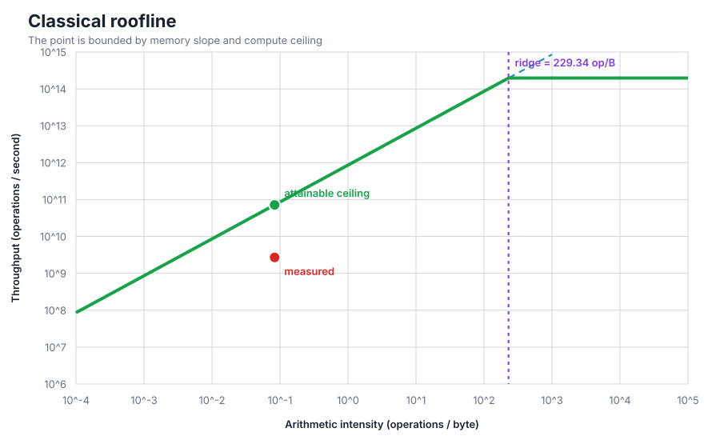
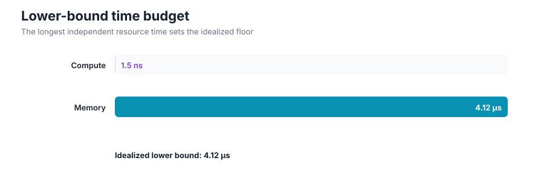

# G5 S1 binary add on one TPU v5e chip

> Treat calculated times as physical lower bounds. Treat only supplied measurements as empirical results.

## Verdict

- Predicted limiting resource: **memory**.
- Idealized lower-bound time: **4.12 µs**.
- Arithmetic intensity: **0.0833 operations/byte**.
- Hardware ridge point: **229 operations/byte**.
- Attainable roofline throughput: **71.6 Gop/s**.
- Measured time: **109 µs**.
- Efficiency against attainable roof: **3.8%**.

## Resource ledger

| Resource | Idealized time | Interpretation |
|---|---:|---|
| Compute | 1.5 ns | Operations divided by effective compute peak |
| Memory | 4.12 µs | Required bytes divided by effective memory bandwidth |

## Static visualizations

## Assumptions and falsifiers

- Count operations and transferred bytes over exactly the same scope as the hardware peaks.
- Replace advertised peaks with sustained or explicitly derated peaks when empirical calibration exists.
- Interpret `max(resource times)` as an optimistic overlap model. Add times only when evidence shows serialization.
- Reclassify the bottleneck when a device profile contradicts the estimate.
- Inspect compiler IR when unexpected fusion, recomputation, padding, layout conversion, or custom-call opacity can change operation or byte counts.
- Configured assumption: One float32 addition is counted per output element.
- Configured assumption: The byte ledger is compiler cost analysis: two 1179648-byte inputs and one 1179648-byte output.
- Configured assumption: The 197 TFLOP/s BF16 peak is only a loose compute ceiling for this float32 vector operation.
- Configured assumption: The 800 GiB/s HBM figure is the vendor theoretical peak; no empirical bandwidth efficiency factor is applied.
- Configured assumption: Measured time is the median of three post-warmup candidate executions from the authoritative verifier.
- Configured assumption: Launch, synchronization, vector-unit limits, VMEM traffic, and compiler scheduling are not represented in the idealized roofline floor.

## Evidence status

- **Calculated:** roofline ceilings, balance points, and resource-time lower bounds.
- **Measured:** values explicitly supplied as `measured_time_s`.
- **Unmeasured:** stalls, launch overhead, bank conflicts, occupancy loss, topology contention, and compiler effects not represented in the input.
